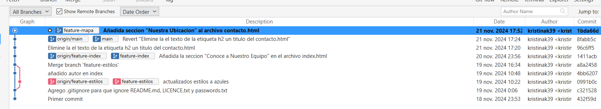
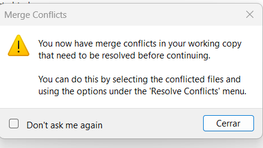

> - Kristina Khachatryan
>
>
> Módulo: Despliegue de Aplicaciones Web

# Ejercicio de Git - proyecto labowebs

[TOC]

## Trabajo Local

> 1. Inicializa un nuevo repositorio Git en una carpeta llamada `labowebs` y agrega los archivos proporcionados en el aula virtual. Renombre la rama master a `main`, si es necesario. Realiza el primer commit. Muestra el log del repositorio.

```bash
$ git init
$ git branch
$ git branch -m master main
$ git add .
$ git commit -m "Primer commit"
```


<div style="page-break-before: always;">


> 2. Incluye un fichero `.gitignore` para que los ficheros `README.md`, `LICENCE.txt` y `passwords.txt` sean ignorados por el control de versiones. Realiza el commit y muestra los logs del repositorio en una linea.

```bash
$ echo -e "README.md\nLICENCE.txt\npasswords.txt" > .gitignore
$ git add .gitignore
$ git commit -m "Agrego .gitignore para que ignore README.md, LICENCE.txt y passwords.txt"
```


<div style="page-break-before: always;">

> 3. En el repositorio, crea los archivos `README.md` `LICENCE.txt` y `passords.txt` con algún contenido. Muestra el estado del repositorio. Muestra el listado de archivos ignorados.

```bash
$ echo -e "README.md\nLICENCE.txt\npasswords.txt" > .gitignore
$ git add . gitignore
$ git commit -m "Agrego .gitignore para qeu ignore README.md, LICENCE.txt y passwords.txt"
$ echo "Este es el archivo README" > README.md
$ echo "Este es el archivo LICENCE" > LICENCE.txt
$ echo "Este es el archivo de password" > passwords.txt
$ git status
$ git ls-files --ignored --exclude-standard -o
```


<div style="page-break-before: always;">

> 4. Crea una rama `feature-estilos`. Cámbiate a ella.
>
>    - Modifica el archivo `estilos.css`:
>
>    - propiedad color de `body` y de `h2`: `#2a2a2a`
>
>    - propiedad `background-color` de `header` y `footer: #2a75ff`
>
>    - Comprueba el estado del repositorio. Añade los cambios, realiza un commit con el mensaje "actualizados estilos a azules"

````bash
$ cd C\: /Users/krism/OneDrive/Escritorio/Despliegue/labowebs/
$ git branch feature-estilos
$ git checkout feature-estilos
$ git status
$ git add labowebs-tarea-git/css/estilos.css
$ git commit -m "actualizados estilos a azules"
````


> 5. Vuelve a la rama `main`. En el archivo `index.html` añade un comentario donde se indique tu nombre como autor de la pagina. Comprueba el estado del repositorio. Añade los cambios, realiza un commit con el mensaje 'añadido autor en index'.  Muestra los logs del repositorio en una línea, gráficamente y con 'decoración'

````bash
$ git checkout main
$ git status
$ git add lobowebs-tarea-git/index.html
$ git commit -m "añadido autor en index"
$ git log --online --graph --decorate
````


> 6. Fusiona la rama `feature-estilos` en la rama `main`. Muestra los logs del repositorio en una linea, gráficamente y con 'decoración'

````bash
$ git checkout main
$ git merge feature-estilos
$ git commit
$ git status
$ git log --oneline --graph --decorate

````

			


<div style="page-break-before: always;">

## Trabajo en remoto


> 1. Continua con el repositorio `labowebs`. Añade el repositorio a Sourcetree.

He añadido el repositorio local "labowebs" a Sourcetree. Aquí muestra las ramas del proyecto, el historial de commits y los cambios realizados.


> 2. Crea un repositorio remoto y sube al remoto los ficheros de tu repositorio local. Debes subir todas las ramas. 

Se creo el repositorio remoto llamado despligueU4 en GitHub. 

En Sourcetree, se añadió el remoto como `origen` y se configuro la URL de repositorio remoto en GitHub.

Se selecciono las ramas `main` y `feature-estilos` en Sourcetree y se realizo el `Push` de ambas al remoto


> 3. Crea una rama `feature-index`. Añade el siguiente código dentro de la `<section class = "about">` . Añade los cambios y crea un commit. Sube los cambios al remoto.
>
>    ````html
>    <h2>Conoce a Nuestro Equipo</h2>
>    <p>Labowebs esta formado por un equipo de diseñadores y desarrolladores apasionados que trabajan juntos para ofrecer soluciones tecnologicas de alta calidad. Cada miembro de nuestro equipo aporta experiencia en diseño, programacion, y soporte tecnico, asegurando que nuestros clientes reciban un servicio completo y personalizado.</p>
>    <p>Nuestro objetivo es que cada cliente se cienta acompañado en su aventura digital, con un equipo profesional que entiende sus necesidades y trabaja para hacer crecer su presencia en linea.
>    </p>
>    ````


Se creo la rama `feature-index` a partir de la rama `main` utilizando Sourcetree. Se modifico en el `index.html` añadiendo un contenido y se subió al repositorio GitHub.


> 4. En el repositorio local, fusiona la rama `feature-index` en la rama `main`.

Se cambio la rama `main` para iniciar el proceso de fusión

Se selecciono la opción de fusión para `feature-index`

La fusión se realizo sin problemas, y ahora los cambios de `feature-index` están incluidos en `main`.


> 5. Edita el fichero `contacto.html`. Borra unas líneas. Muestra los ficheros con cambios pendientes y las diferencias. Añade los cambios y haz un commit.


> 6. Te das cuenta del error. Deshaz el commit anterior. Captura el estado actual del repositorio.

Se deshizo el último commit utilizando `Reverse Commit` 


> 7. Crea una rama `feature-mapa`. Incluye este código en el archivo `contacto.htm`. Añade los cambios. Realiza un commit. Sube los cambios al remoto. Muestra en el remoto los cambios del archivo `contacto.html` en la rama `feature-mapa`.
>
>    ````html
>    <section class="map">
>        <h2>Nuestra Ubicación</h2>
>        <p>C/Luis Moya 335, Gijón, Asturias</p>
>        <inframe src="http://www.google.com/maps?Q=C%2Luis%20Moya%20335%2C%20Gij%C3%B3n%2C20Asturias&output=embed" width="600" height="400" style="border:0;" "allowfullscreen="loading="lazy"</inframe>
>    </section>
>    ````
>
>    





> 8. En GitHub, en la rama `main` fusiona la rama `feature-mapa`. Baja los cambios del remoto a local. Deja los dos repositorios sincronizados.
>
>    


<div style="page-break-before: always;">

## Conflictos 


> 1. Crea una rama `hotfix-js`. Cámbiate a ella. Añade este código en el fichero `script.js`. Confirma el cambio y haz un commit. (*Fíjate en los números de linea...*).
>
>    ````js
>    if(mensaje.value.trim() === ""){
>        alert("Por favor, ingrese un mensaje.");
>        valid = false;
>    }
>    ````


Se creo la rama `hotfix-js` para implementar una validación en el archivo `script.js` para mensajes. Los cambios se confirmaron con un commit y enviados al repositorio remoto.


> 2. Vuelve a la rama `main` . En el fichero `script.js` en las mismas líneas que en la cuestión anterior, añade el código siguiente. Confirma el cambio ha haz un commit.
>
>    ````js
>    if (mensaje.value.trim() === "") {
>        alert("Ingrese un mensaje, por favor");
>        valid = false;
>    }
>    ````
>
>    


> 3. Fusiona la rama `hotfix-js`, en `main`. Debe producirse un conflicto. Resuélvelo. Cuando termines la resolución del conflicto sube los cambios al remoto - Deja los repositorios sincronizados. 


Al intentar fusionar la rama `hotfix-js` con `main`, surgió un conflicto en el archivo `script`. Esto paso porque cada rama tenia modificaciones en el archivo `script.js`. Ambas ramas se había añadido validaciones diferentes para el campo "mensaje". Al intentar fusionarlas, Git detecto que las modificaciones estaban en las mismas líneas, lo que causo un conflicto. 

En la rama `main`, incluía el mensaje "Ingrese un mensaje, por favor", mientras que en la rama `hotfix-js`, el mensaje era "Por favor, ingrese un mensaje". Ambas validaciones cumplían el mismo propósito pero estaban escritas de manera deferente. Se dejo las validaciones en ambas ramas igual solo cambiando el mensaje dejando "Por favor, ingrese un mensaje".





